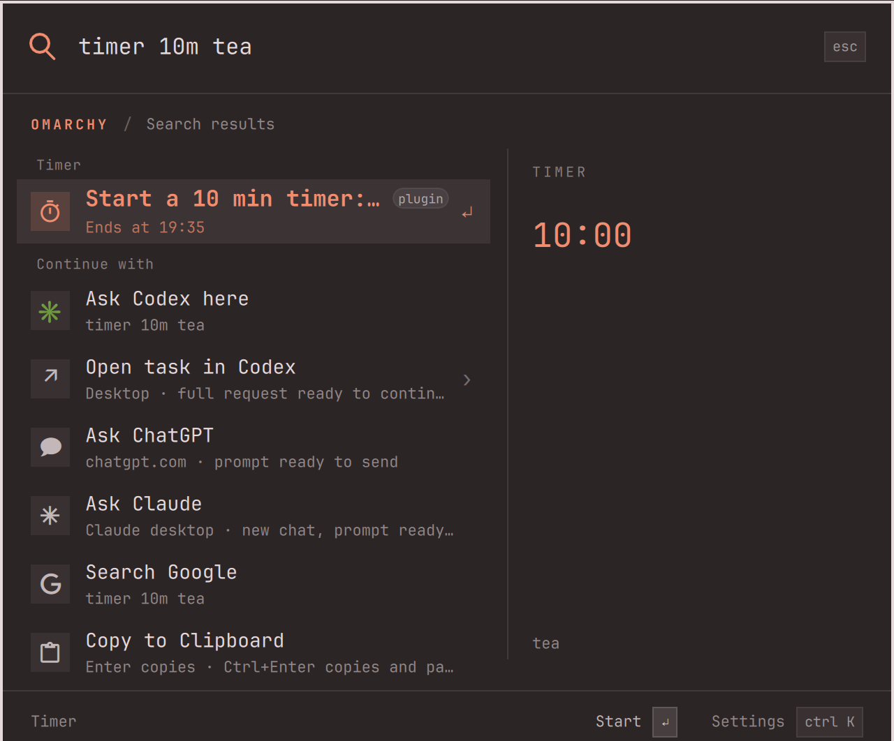

# Keystroke Timer

Countdown timers for the [Keystroke](https://github.com/evindor/keystroke) command palette on Omarchy. Type `timer 10m tea`, press Enter, and a notification tells you when the tea is ready. Timers keep running after the palette closes because the plugin is a headless Omarchy service.

This is also the reference community extension for Keystroke: small enough to read in one sitting, complete enough to copy. It shows a provider with settings, answer and list rows, a scoped screen, confirmations, a service that outlives the palette, and unit tests.

<p align="center"></p>

## Install

Requires Omarchy ≥ 4.0.2 with Keystroke enabled as the menu.

From the palette: open **Extensions** (type `ext`), pick **Timer**, confirm. Or, from a terminal:

```sh
omarchy plugin add https://github.com/evindor/keystroke-timer.git --enable
```

Extensions installed from the terminal start switched off inside Keystroke. Turn this one on under **Extensions → Timer → Enabled** (or Keystroke Settings → Timer). Extensions installed from the palette are enabled straight away.

## Use

| Query | Result |
| --- | --- |
| `timer 10m tea` | 10 minutes, labelled *tea* |
| `timer 1h30m` · `timer 1:30:00` | 1 h 30 min |
| `timer 90` | a bare number after `timer` is minutes |
| `timer tea` | the default length (Settings → Timer → Default length) |
| `10 min tea` · `45s` | works without the prefix when a unit is present, ranked as an ordinary item |
| `countdown …` · `remind me in …` | aliases for `timer` |

Enter starts the timer and closes the palette. **Timers** at the palette root (or the running timer rows themselves) opens the list: each row shows the remaining time and Enter cancels it after a confirmation. When a timer ends you get an Omarchy notification.

## Settings

Keystroke Settings → Timer:

- **Default length (minutes)**: used when no duration is given. Default 5.
- **Notify when a timer ends**: on by default.

Values live under `providers.io.github.evindor.keystroke-timer` in `~/.config/omarchy/keystroke.json`.

## Remove

From the palette: **Extensions → Timer → Remove**. Or:

```sh
omarchy plugin remove io.github.evindor.keystroke-timer
```

Removal unloads the service and deletes the folder under `~/.config/omarchy/plugins/`. Your settings in `keystroke.json` are left alone; delete the `providers.io.github.evindor.keystroke-timer` block by hand if you want them gone.

## Limits and dependencies

- Timers are kept in memory. Restarting `omarchy-shell` (for example after an Omarchy update) forgets running timers.
- No external dependencies. Notifications go through Omarchy's own `omarchy-notification-send`; no sudo, no network, no daemons.
- Like every Omarchy plugin, this one runs unsandboxed inside your shell with your permissions. Read `Service.qml` before you enable it; it is short.

## Develop

```sh
git clone https://github.com/evindor/keystroke-timer.git
cd keystroke-timer
bin/test                      # qmltestrunner unit tests, omarchy plugin validate, qmllint
```

Layout:

- `manifest.json`: an Omarchy `service` plugin with the `x-keystroke` marker Keystroke looks for.
- `Service.qml`: the provider object (`query`, `activate`, `opened`, `settings`) and the service state.
- `core/Timer.js`: parsing and row building as pure functions.
- `tests/tst_timer.qml`: unit tests for the pure functions.

To iterate on a local checkout, copy it into place (Omarchy refuses symlinks inside plugin folders):

```sh
rsync -a --delete --exclude .git ./ ~/.config/omarchy/plugins/io.github.evindor.keystroke-timer/
omarchy-shell shell rescanPlugins
```

To start your own extension, use this repository as a template (**Use this template** on GitHub, or copy the files), change the `id`, `name` and `description` in `manifest.json`, and follow the [Keystroke extension guide](https://github.com/evindor/keystroke/blob/main/AGENTS.md). It is written for people and for coding agents alike.

## License

[MIT](LICENSE).
